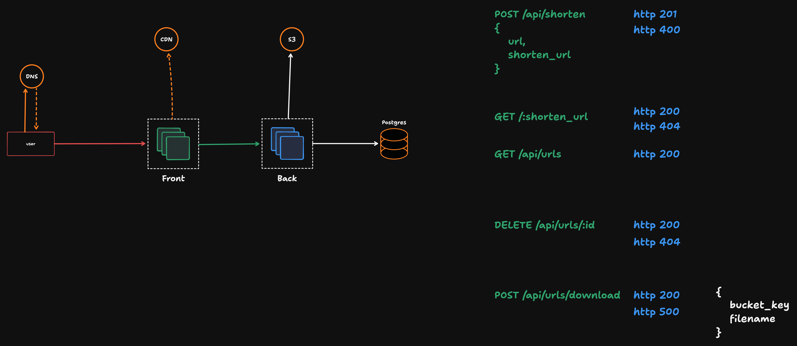

# Server

### Requisitos funcionais
- [X] Deve ser possível criar um link
  - [X] Não deve ser possível criar um link com URL encurtada mal formatada
  - [X] Não deve ser possível criar um link com URL encurtada já existente
- [X] Deve ser possível deletar um link
- [X] Deve ser possível obter a URL original por meio de uma URL encurtada
- [X] Deve ser possível listar todas as URL’s cadastradas
- [X] Deve ser possível incrementar a quantidade de acessos de um link
- [ ] Deve ser possível exportar os links criados em um CSV
  - [ ] Deve ser possível acessar o CSV por meio de uma CDN (Amazon S3, Cloudflare R2, etc)
  - [ ] Deve ser gerado um nome aleatório e único para o arquivo
  - [ ] Deve ser possível realizar a listagem de forma performática
  - [ ] O CSV deve ter campos como, URL original, URL encurtada, contagem de acessos e data de criação.

> [!NOTE]
> Para esse desafio é esperado que você utilize o banco de dados Postgres.

---

## Coisas a fazer

- [X] pn i -D typescript @types/node tsx
- [X] pn i -D vitest vite-tsconfig-paths dotenv-cli
- [X] pn i -D drizzle-kit
- [X] pn i fastify @fastify/cors zod fastify-type-provider-zod @fastify/swagger @fastify/swagger-ui @fastify/multipart
- [X] pn i drizzle-orm
- [X] pn i postgres
- [X] pn i uuidv7

---

[Task board]([https://](https://app.clickup.com/9013846484/v/b/6-901311956451-2))
