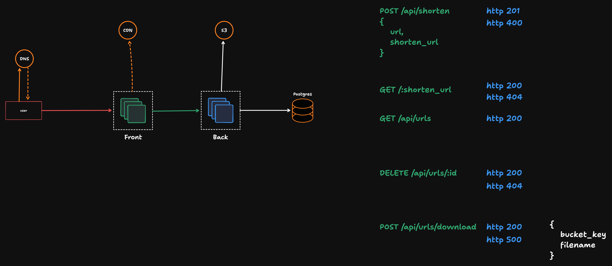

# Web

### Requisitos funcionais
- [ ]  Deve ser possível criar um link
  - [ ]  Não deve ser possível criar um link com encurtamento mal formatado
  - [ ]  Não deve ser possível criar um link com encurtamento já existente
- [ ]  Deve ser possível deletar um link
- [ ]  Deve ser possível obter a URL original por meio do encurtamento
- [ ]  Deve ser possível listar todas as URL’s cadastradas
- [ ]  Deve ser possível incrementar a quantidade de acessos de um link
- [ ]  Deve ser possível baixar um CSV com o relatório dos links criados

### Requisitos não funcionais

- [ ]  É obrigatória a criação de uma aplicação React no formato SPA utilizando o Vite como `bundler`;
- [ ]  Siga o mais fielmente possível o layout do [Figma]([https://](https://www.figma.com/design/M4HhQtivjhSVnnPrPUfnio/Encurtador-de-Links--Community-?node-id=3-376&p=f&t=Spjrr4yrDb5f8pgK-0));
- [ ]  Trabalhe com elementos que tragam uma boa experiência ao usuário (`empty state`, ícones de carregamento, bloqueio de ações a depender do estado da aplicação);
- [ ]  Foco na responsividade: essa aplicação deve ter um bom uso tanto em desktops quanto em celulares.

